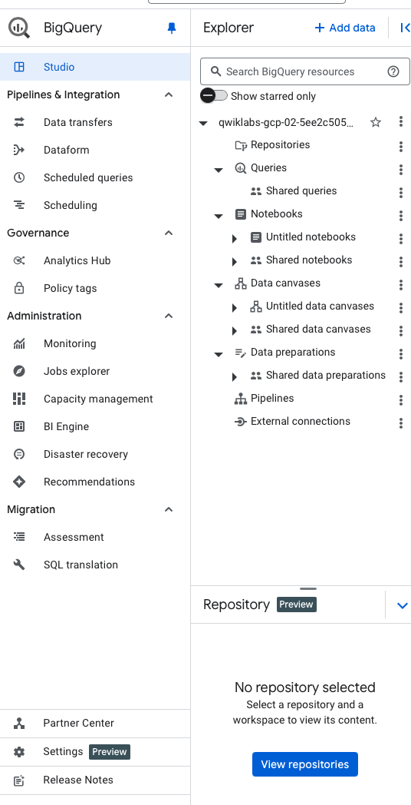

Big Query

1. About Big Query
2. Setting up Big Query using terraform 

    Includes , API enablement, Project Setup , Permissions, example schema , monitoring, security features , Service account permissions 

3. Big Query Skill Badge 
    https://www.cloudskillsboost.google/course_templates/624

4. Challege Lab
    https://www.cloudskillsboost.google/focuses/37320?catalog_rank=%7B%22rank%22%3A2%2C%22num_filters%22%3A1%2C%22has_search%22%3Atrue%7D&parent=catalog&search_id=43990800

5. Connect mySQL workbench with Big Query 

Introduction: 

