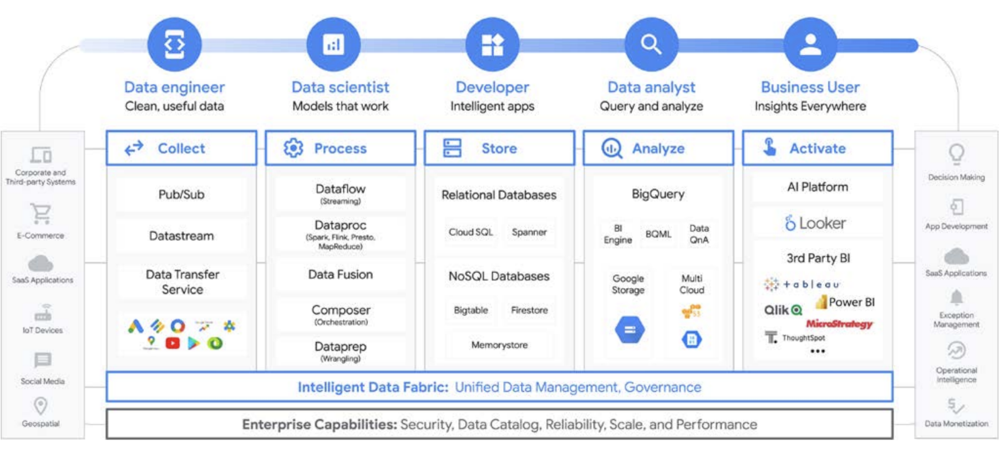
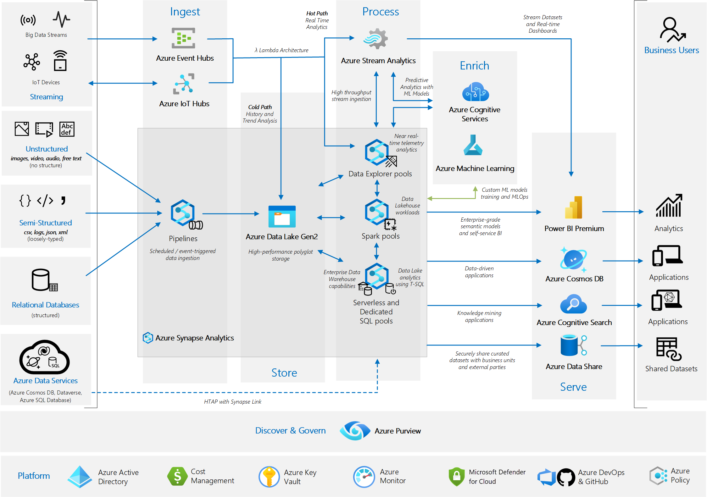
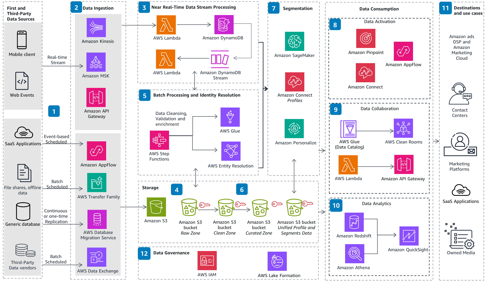

Data Hosting
---

The Data can be hosted with variety of options 

#### Data Storage Platforms 

Database vs Data Lake vs Data Warehouse vs Data Platform 

Others : Data Mart, Data Hub

|Attribute         |Database                                                                                                                                                       |Data Lake                                                                                                                                                                                                         |Data Warehouse                                                                                                                                                                        |
|---------------------|---------------------------------------------------------------------------------------------------------------------------------------------------------------|------------------------------------------------------------------------------------------------------------------------------------------------------------------------------------------------------------------|--------------------------------------------------------------------------------------------------------------------------------------------------------------------------------------|
|Workloads            |Operational and transactional                                                                                                                                  |Analytical                                                                                                                                                                                                        |Analytical                                                                                                                                                                            |
|Data Type            |Structured or semi-structured                                                                                                                                  |Structured, semi-structured, and/or unstructured                                                                                                                                                                  |Structured and/or semi-structured                                                                                                                                                     |
|Schema Flexibility   |Rigid or flexible schema depending on database type                                                                                                            |No schema definition required for ingest (schema on read)                                                                                                                                                         |Pre-defined and fixed schema definition for ingest (schema on write and read)                                                                                                         |
|Data Freshness       |Real time                                                                                                                                                      |May not be up-to-date based on frequency of ETL processes                                                                                                                                                         |May not be up-to-date based on frequency of ETL processes                                                                                                                             |
|Users                |Application developers                                                                                                                                         |Business analysts, application developers, and data scientists                                                                                                                                                    |Business analysts and data scientists                                                                                                                                                 |
|Pros                 |Fast queries for storing and updating data                                                                                                                     |Easy data storage simplifies ingesting raw data A schema is applied afterwards to make working with the data easy for business analysts Separate storage and compute                                              |The fixed schema makes working with the data easy for business analysts                                                                                                               |
|Cons                 |May have limited analytics capabilities                                                                                                                        |Requires effort to organize and prepare data for use                                                                                                                                                              |Difficult to design and evolve schema Scaling compute may require unnecessary scaling of storage, because they are tightly coupled                                                    |
|Data Structure       |Primarily store structured data with predefined schemas. They are ideal for transactional data and applications requiring frequent read/write operations.      |Can store structured, semi-structured, and unstructured data. They do not require predefined schemas and can store raw data in various formats.                                                                   |Also store structured data but from multiple sources. They use predefined schemas and are useful for read-heavy operations, analytics, and reporting                                  |
|Purpose and Use Cases|Used for day-to-day operations to manage transactional data and applications needing immediate read/write access, like customer databases and inventory systems|Serve as a central repository for all types of data, which enables data scientists and analysts to run machine learning models and big data analytics. Suitable for AI/ML applications and exploratory data analys| Built for analytical processing, i.e., aggregating data from various sources to generate business insights. Ideal for historical data analysis, business intelligence, and reporting.|
|Data Processing      |Handle real-time data processing with immediate read/write capabilities and ensure transactional consistency and integrity.                                    |Allow batch and stream processing.They support ETL and ELT (Extract, Load, Transform) processes, providing flexibility in how and when data is transformed.                                                       |Use batch processing to integrate data from multiple sources, transforming it to support complex queries and analytics. ETL (Extract, Transform, Load) processes are common           |
|Cost and Scalability |Generally cost-effective for small to medium-sized applications with moderate data volumes. Scalability can be limited.                                        |More cost-effective for storing vast amounts of raw data, including semi-structured and unstructured data. They offer high scalability and support growth in data volume and variety.                             |Often require significant investment in hardware and software, but provide high scalability for large volumes of structured data. They are optimized for performance and query speed  |
|Flexibility          |There is limited flexibility due to rigid schema requirements. It is challenging to adapt to new types of data without significant reengineering.              | Highly flexible, allowing organizations to store data in raw format. They support various data formats and structures, which make it easier to adapt to new data sources and analytical needs.                   |These are more flexible than databases but rely on predefined schemas. They require careful planning and design to accommodate changes in data sources and structures.                |

#### Data Platform

Data Platform: A Unified Hub for Data Management

A data platform is a comprehensive, integrated set of technologies that enables organizations to effectively manage their entire data lifecycle. It's like a central command center for all your data-related activities, from collection and storage to analysis and utilization.   

Key Components of a Data Platform

A typical data platform encompasses several key components:   

1. Data Ingestion:

    - Data Sources: Diverse sources like databases, applications, sensors, social media, and cloud services.   
    - Data Pipelines: Tools and processes for extracting, transforming, and loading (ETL) data from various sources into the platform.   

2. Data Storage:

    - Data Warehouses: Optimized for analytical workloads, providing fast query performance on large datasets.   
    - Data Lakes: Designed for storing large volumes of raw and unstructured data in its native format.   
    - Data Marts: Smaller, focused subsets of a data warehouse, tailored to specific business needs.  

3. Data Processing:

    - Data Transformation: Tools for cleaning, enriching, and preparing data for analysis.   
    - Data Integration: Combining data from multiple sources to create a unified view.   
    - Data Modeling: Creating structured representations of data for analysis and reporting.   

4. Data Analysis and Visualization:

    - Business Intelligence (BI) Tools: Software for interactive data exploration, reporting, and dashboarding.   
    - Data Mining and Machine Learning: Techniques for discovering hidden patterns and insights in data.   
    - Data Visualization Tools: Creating charts, graphs, and other visual representations of data.   

5. Data Governance and Security:

    - Data Quality: Ensuring data accuracy, completeness, and consistency.
    - Data Security: Protecting sensitive data from unauthorized access and breaches.   
    - Data Compliance: Adhering to relevant regulations and industry standards.   

**Benefits of a Data Platform**

- Improved Decision Making: Access to accurate, timely, and insightful data empowers better business decisions.   
- Increased Efficiency: Automation of data processes reduces manual effort and frees up valuable time.   
- Enhanced Customer Experience: Data-driven insights enable personalized experiences and improved customer satisfaction.   
- Competitive Advantage: Gain a deeper understanding of market trends, customer behavior, and competitive landscape.   
- Innovation: Fuel innovation by unlocking the potential of data for new products, services, and business models.

   
Some Types of data platforms for purpose driven 

Data platforms can be built and configured to serve specific business functions. Some of the most common types of data platforms include:

- Enterprise data platform (EDP)
- Big data platform (BDP)
- Cloud data platform (CDP)
- Customer data platform (CDP)

**Enterprise data platform (EDP)**

Enterprise data platforms were originally developed to serve as central repositories to make data more accessible across an organization. These platforms typically housed data on-premises, in operational databases or data warehouses. They often handled structured customer, financial and supply chain data.

Today’s modern data platforms expand the capabilities of traditional enterprise data platforms to male sure that data is accurate and timely, reduce data silos and enable self-service. Modern data platforms are often built on a suite of cloud-native software, which supports more flexibility and cost-effectiveness.

The two fundamental principles that govern enterprise data platforms are:

Availability: Data is readily available in a data lake, data warehouse or data lakehouse, which separate storage and compute. Splitting these functions makes it possible to store large amounts of data relatively inexpensively.

Elasticity: Compute functions are cloud-based, which enables autoscalability. For example, if most data and analytics are used at a certain day and time, processing can be automatically scaled up for a better customer experience and scaled back down as workload needs decrease.

**Big data platform (BDP)**

A big data platform is designed to gather, process and store large volumes of data, often in real time. Given the huge volumes of data they handle, big data platforms often use distributed computing, with the data spread across many servers.

Other types of data platforms might also manage large volumes of data, but a big data platform is specially designed to process that data at high speeds. An enterprise-grade BDP is able to run complex queries against massive datasets, whether structured, semistructured or unstructured. Typical BDP uses include big data analytics, fraud detection, predictive analytics and recommendation systems.

Big data platforms are often available as software-as-a-service (SaaS) products, as part of a data as a service (DaaS) offering or in a cloud computing suite.

**Cloud data platform (CDP)**

As the name implies, the defining feature of a cloud data platform is that it is cloud-based, which can provide multiple benefits:

A cloud data platform is often available on a pay-as-you-go basis.
Total storage space is flexible, for scaling up or down as needed.
Staff is not needed to maintain an on-premises hardware platform.
A cloud data platform can house platforms for big data, enterprise data or customer data.
Many CDPs offer supplemental capabilities such as advanced analytics, 
machine learning (ML) and visualization tools.

**Customer data platform (CDP)**

A customer data platform collects and unifies customer data from multiple sources to build a single, coherent and complete view of every customer.  

Input to the CDP might be received from an organization’s customer relationship management (CRM) system, social media activity, touchpoints with the organization, transactional systems or website analytics.

A unified, 360-degree view of customers can give an organization greater insight into their behavior and preferences, enabling more targeted marketing, better user experiences and new revenue opportunities.

Commonly Data platforms can come in all shapes and sizes, depending on the needs of the organization. A typical platform includes at least these five layers:

- Data storage
- Data ingestion for Streaming and Batch 
- Data transformation
- Business intelligence and analytics
- Data observability

Examples of Data Platforms

Google Data Management Platform for Unified Analytics 

[Source](https://cloud.google.com/resources/googlecloud-unified-analytics-data-platform-paper?hl=en)

Azure Data Management Platform for Unified Analytics

[Source](https://microsoft.github.io/BeLuxPartnerTechTeam/data-ai/_getting-started/1.envisioning/referencearchitectures/index.html)

AWS Customer Data Management Platform 

[Source](https://aws.amazon.com/solutions/guidance/customer-data-platform-on-aws/)

