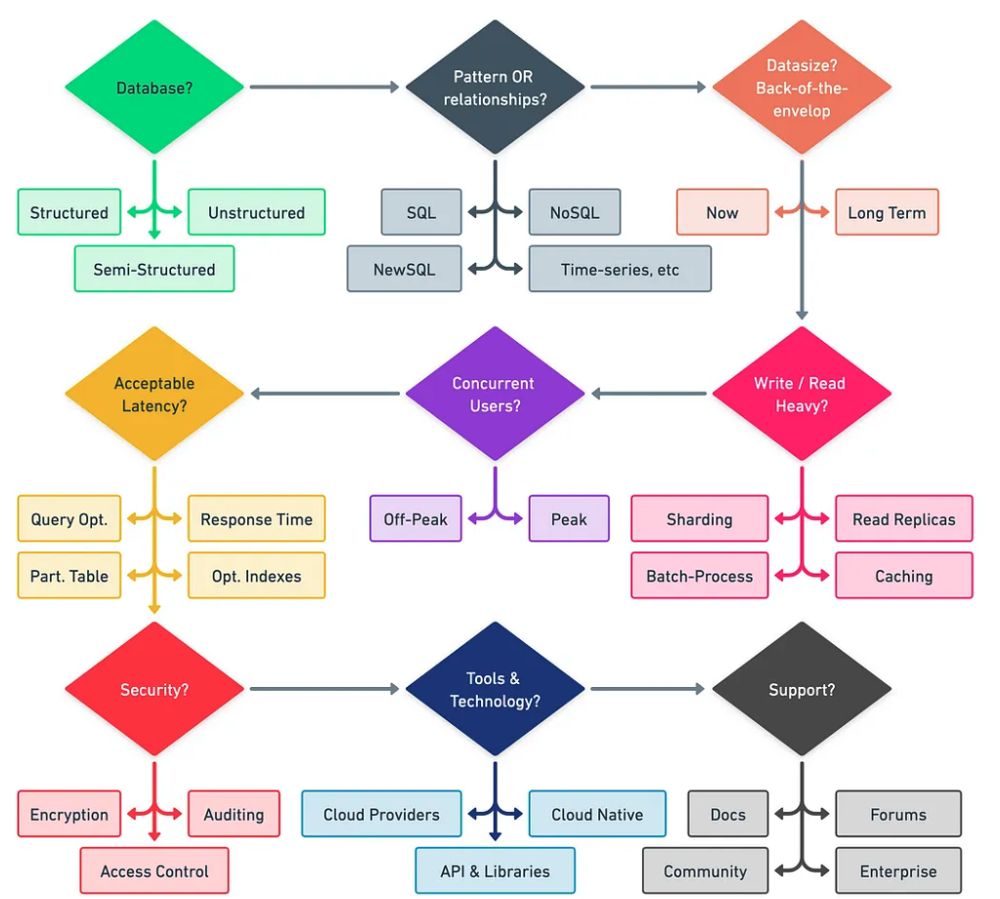
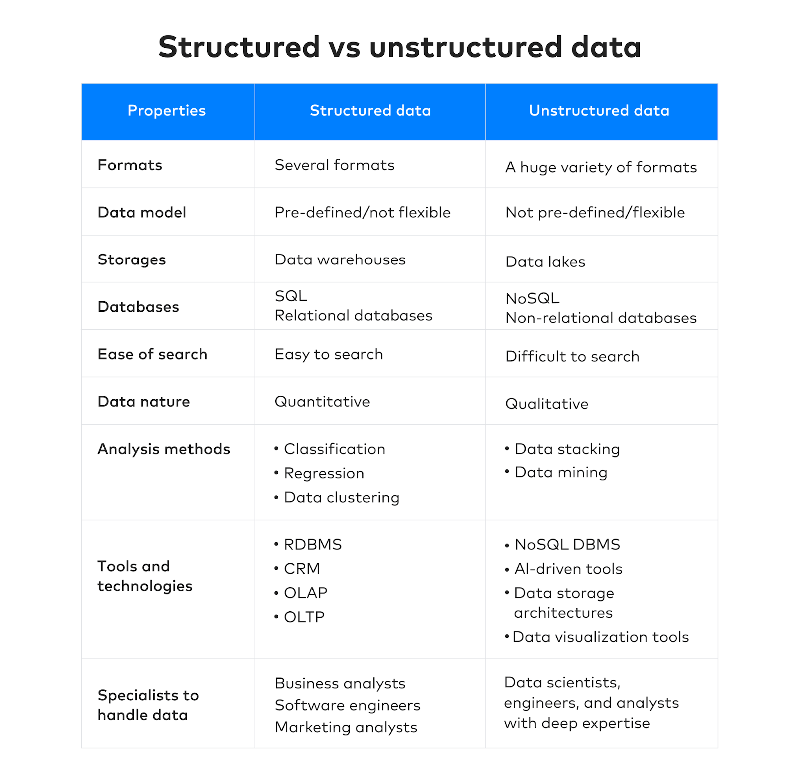
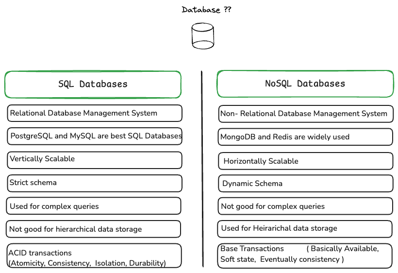
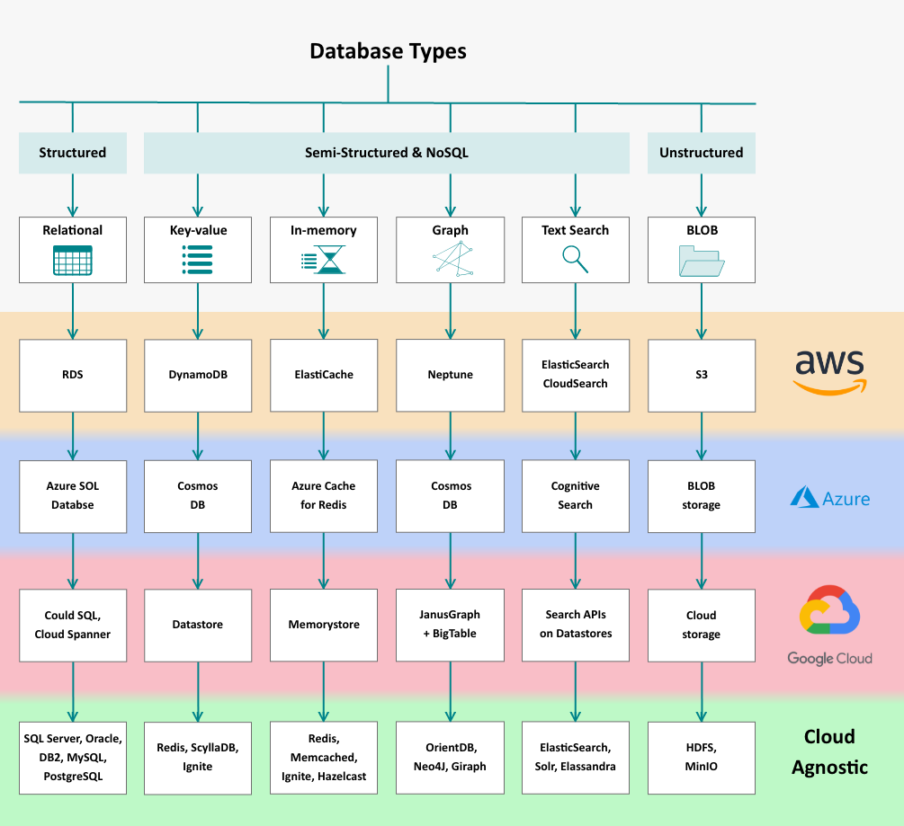

Databases & SQL in Machine Learning Context
---

## Determing the Database

In Machine Learning , Databases are used with both SQL and NoSQL options  , Choosing Databases depends upon Structured vs Semi-Structured &No SQL and UnStructured Data.  These considerations provided in following charts.

Database selection process

Structured vs Non Structured Data 

SQL vs No-SQL consideration 

Database Examples with providers

### SQL Databases:

1. PostgreSQL : 
    PostgreSQL is a robust, open-source SQL database that is well-suited for handling complex queries and intricate machine learning algorithms. 

2. MySQL : 
    MySQL is another popular SQL database that can be used to store and manage data for machine learning, with MySQL HeatWave AutoML offering in-database machine learning capabilities. 

3. BigQuery : 
    Google BigQuery is a fully managed, serverless data warehouse platform that allows users to analyze large datasets using SQL queries

4. Microsoft SQL Server Databases For Machine Learning & AI:
    MongoDB: This database is known for its flexibility, which lets you store varied data types without compromising speed or scalability.
    Cassandra: Loved for its linearly scalable architecture, Cassandra ensures fault tolerance across many commodity servers – crucial for large-scale data operations.
    PostgreSQL: It’s loved by developers for its robustness and ability to handle complex queries, making it ideal when dealing with intricate ML algorithms.   

### No SQL Databases:

1. MongoDB :
2. Time Series DB: 
3. Cassandra

and many more 

### Unstructured Storage/Databases

Unstructured Examples include:

- Text documents (Word documents, PDFs, emails) 
- Images (JPEGs, PNGs) 
- Audio files (MP3s, WAVs) 
- Video files (MPEGs, AVIs) 
- Social media posts 
- Emails 
- Sensor data 

How is Unstructured Data Stored?

- Object Storage: Object storage, like Amazon S3, is another option for storing unstructured data, offering scalability and cost-effectiveness. 

Examples are:  
        - AWS:S3 , Azure - Blob Storage , Google  - Google Cloud Storage , On-Prem - MinIO, NetApp Object, VMware Storage (OSE)

- File Systems: Traditional file systems, like those used on computers, can store unstructured data in various formats. 
- Digital Asset Management (DAM) Systems: These systems are designed to manage and store digital assets like images, videos, and documents. 
- Content Management Systems (CMS): CMS are used to manage and store content, including unstructured data like text and images. 
- NoSQL Databases: Sometimes NoSQL databases (like MongoDB) are well-suited for storing unstructured data due to their flexible schema and ability to handle large volumes of data. 
- Data Warehousing & Data Lakes: Large collections of unstructured data stores are called data lakes, which can store various data formats. 
- Hadoop: Hadoop is a framework that can store and process large amounts of unstructured data. 

Some References

- https://cloud.google.com/blog/topics/developers-practitioners/your-google-cloud-database-options-explained
- https://learn.microsoft.com/en-us/azure/architecture/data-guide/technology-choices/data-store-classification

