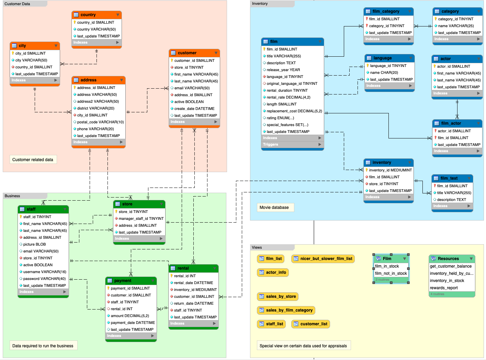

---
## SQL Databases 
---
A SQL database, also known as a relational database, is a system that stores and organizes data into highly structured tables of rows and columns. These databases offer Structured Query Language (SQL) to read and write the data, and are categorized as relational database management systems (RDBMS).
There are numerous SQL database engines (products) used to build software applications. Some of the most popular include PostgreSQL, MySQL, SQL Server, and Oracle. Some database engines are open source while others are commercial offerings.

### ER Diagram (or Enhanced Entity-Relationship (EER))

The following is a sample ER Diagram 

Following points should be observed

Overall diagram

1. Tables (By Business domain i.e Customer Data , Business, Inventory)
2. Relationships between represented by connectors ( Noted by 1-1, 1-m, m-m...)

Within Table 

1. Primary key 
2. Foriegn Key
3. Column Names with Symbols for each ( INT, VARCHAR, DATETIME, BOOLEAN, TEXT )

Others

1. Views - Stored Queries to provide information
2. SQL Routines - SQL routines are routines that have logic implemented with only SQL statements, including SQL Procedural Language (SQL PL) statements

### SQL Commands and Queryies

In  SQL, commands are categorized into DDL, DML, DCL, TCL, and DQL.

Types of SQL Commands : 

1. DML (Data Manipulation Language)
2. DDL (Data Definition Language)
3. DQL (Data Query Language)
4. DCL (Data Control Language)
5. TCL (Transaction Control Language)

Definition of the commands 

- **DDL(Data Definition Language):** To make/perform changes to the physical structure of any table residing inside a database, DDL is used. These commands when executed are auto-commit in nature and all the changes in the table are reflected and saved immediately.

    - CREATE: Creates a new table or database.
    - ALTER: Modifies an existing database object.
    - DROP: Deletes an entire table, database, or other objects.
    - TRUNCATE: Removes all records from a table, deleting the space allocated for the records.
    

- **DML(Data Manipulation Language):** Once the tables are created and the database is generated using DDL commands, manipulation inside those tables and databases is done using DML commands. The advantage of using DML commands is, that if in case any wrong changes or values are made, they can be changed and rolled back easily.

    - SELECT: Retrieves data from the database.
    - INSERT: Adds new data to a table.
    - UPDATE: Modifies existing data within a table.
    - DELETE: Removes data from a table.

- **DQL(Data Query Language):** Data query language consists of only one command upon which data selection in SQL relies. The SELECT command in combination with other SQL clauses is used to retrieve and fetch data from databases/tables based on certain conditions applied by the user.

    - SELECT: Retrieves data from the database. 
    - JOIN: Combines rows from two or more tables based on a related column between them.
    - FROM: Specifies the table from which the data will be retrieed
    - DISTINCT: Fetch Unique Values
    - ORDERBY : Sort the data by column
    - HAVING: filter based on condition
    - LIMIT: Limit the output returned by the query
    - UNION: Combine the Result of two SELECT commands
    - EXISTS: Include Subquery and return any rowns
    - IN: Check if any value is in a list of values
    - LIKE: Used for Patterm Matching in Strings  

- **DCL(Data Control Language):** DCL commands as the name suggests manage the matters and issues related to the data controller in any database. DCL includes commands such as GRANT and REVOKE which mainly deal with the rights, permissions, and other controls of the database system.

    - GRANT: Gives users access privileges to the database.
    - REVOKE: Removes access privileges given with the GRANT command.

- **TCL(Transaction Control Language):** Transaction Control Language as the name suggests manages the issues and matters related to the transactions in any database. They are used to roll back or commit the changes in the database.

    - COMMIT: Saves all changes made in the current transaction.
    - ROLLBACK: Restores the database to the last committed state.
    - SAVEPOINT: Sets a savepoint within a transaction.
    - SET TRANSACTION: Places a name on a transaction.

#### SQL Order of Execution

FROM and/or JOIN clause
WHERE clause
GROUP BY clause
HAVING clause
SELECT clause
DISTINCT clause
ORDER BY clause
LIMIT and/or OFFSET clause

--- 

----

**CONCAT**

SELECT 
    CONCAT('Book Name',':',book_name,',','Author',':',author,',','Book price',':',book_price) as Book_Description 
    FROM books 
    ORDER BY book_name

**ROUND CALCULATION**

SELECT
    emp_id, name, salary, ROUND(salary + (0.2 * salary),0)  as New_salary
    FROM employees
    ORDER BY emp_id

**NOT EQUALTO <>**
SELECT 
    *
    FROM job_history
    WHERE employee_id <> 101
    ORDER BY employee_id, job_id

**OR with Condition**

SELECT name, population, area 
    FROM world 
    WHERE area >= 3000000 OR population >= 25000000 
    ORDER BY name ASC

**LIKE with %**

SELECT original_title, director, genres, cast, budget, revenue, runtime, vote_average
    FROM movies 
    WHERE keywords LIKE '%sport%' OR keywords LIKE '%sequel%' OR keywords LIKE '%suspense%'
    ORDER BY original_title ASC

**NULL**

SELECT employee_id, first_name, last_name, salary
FROM employees
WHERE commission_pct IS NULL
  AND salary BETWEEN 5000 AND 10000
  AND department_id IN (50, 10, 80)
ORDER BY employee_id ASC;

**BETWEEN**

SELECT orderNumber,requiredDate 
    FROM orders 
    WHERE orderDate BETWEEN '2003-12-01' AND '2003-12-31'
    AND status = "Shipped"
    ORDER BY orderNumber

**AND and Condition**

SELECT original_title 
    FROM MOVIES 
    WHERE (release_year > 2014 AND vote_average > 7)
    ORDER BY original_title asc;

**DISTINCT**

SELECT DISTINCT author_id as id
    FROM views
    WHERE author_id = viewer_id
    ORDER BY id

**CASE**

SELECT quantity,
case
  when quantity > 6 then "bulk purchase"
  when quantity between 4 and 6 then "moderate purchase "
  else "small purchase"
end as qty_bucket
from `sathish-scaler-projects.farmers_market.customer_purchases`
order by quantity desc

**LIKE**

SELECT employee_id, 
        concat (first_name ,' ',last_name) as full_name,
        phone_number 
        from employees
        where first_name like '%n'
        order by employee_id

**OFFSET**

SELECT  * from movies order by revenue desc limit 1 OFFSET 2

**NULL**

SELECT employee_id, first_name, last_name, job_id, manager_id
FROM employees
WHERE department_id is NULL
ORDER by employee_id

**Timestamp and Between**

SELECT DISTINCT user_id
FROM purchases
WHERE time_stamp  Between '2022-03-08' and  '2022-03-20' and amount >=  1000
ORDER BY user_id

**"=" Condition Operator**

SELECT * FROM city WHERE countrycode = 'JPN'

**LIMIT and OFFSET**

SELECT
employee_number,
first_name,
last_name,
salary

FROM employees
ORDER BY salary DESC
LIMIT 2 OFFSET 3;

#### Day 4 Assignments - Subqueries , Grouby and Aggregation 

**ROUND**

SELECT employee_id , round(ifnull(commission_pct,0),2) AS commission_pct
 FROM employees
 ORDER BY employee_id;

**SUBQUERIES**

 SELECT employee_id, CONCAT(first_name,' ', last_name) as full_name,salary from
employees e1 join departments d1
on e1.department_id=d1.department_id
and d1.department_name in ( 'Administration', 'Marketing', 'Human Resources');

**NOT IN**
SELECT * from employees
WHERE employee_id not in (select employee_id from job_history)
ORDER BY employee_id asc 

**SUBQUERIES** 

SELECT  CONCAT(first_name,' ', last_name) as full_name, salary, department_id, job_id
FROM employees
WHERE job_id = (SELECT job_id FROM employees WHERE employee_id = 107)
ORDER BY full_name

**SUBQUERIES and CASE Statement**
SELECT employee_id, first_name, last_name, salary, (CASE WHEN job_id IN ('FI_ACCOUNT', 'AC_ACCOUNT') THEN 1 ELSE 0 END) as Accountant
from employees
ORDER BY employee_id

**CASE STATEMENT with Operators**

SELECT employee_id, salary , 
(CASE When salary >  20000 THEN 'Class A'
  When salary BETWEEN 10000 AND 20000 THEN 'Class B'
  When salary <  10000 THEN 'Class C'
END
)AS Salary_bin
FROM employees
ORDER BY employee_id

**MAX Function**

SELECT MAX(num) as num
FROM
    (SELECT num
    FROM mynumbers
    GROUP BY num
    HAVING COUNT(num) =1) AS t

**CASE with Condition**

SELECT x, y, z,
    CASE
        WHEN (x + y > z) AND (y + z > x) AND (x + z > y) THEN 'Yes'
        ELSE 'No'
    END AS triangle
FROM triangle
ORDER BY x, y, z ASC

**CONDITION ** 

select round(sum(long_w),4) as sum
from station
where long_w between 38.7880 and 137.2345;

**Condition**

SELECT
earnings, count(*) as num_employees
FROM(SELECT  (salary*months) AS earnings, employee_id
FROM employee )temp
GROUP BY earnings
HAVING earnings = (SELECT max(salary*months) AS earnings FROM employee)

**IFNULL**

SELECT employeeNumber,firstName,lastName,IFNULL(email,'N/A') as email,IFNULL(phone,'N/A') as phone
FROM employees
ORDER BY employeeNumber 

**JOIN**

SELECT employee_id, first_name, last_name, job_id 
FROM employees e 
JOIN departments d ON e.department_id = d.department_id 
JOIN locations l ON d.location_id = l.location_id 
WHERE l.city = 'Seattle' 
ORDER BY employee_id

**COUNT Aggregation**

SELECT COUNT(DISTINCT(customer_id)) as rich_count
FROM store
WHERE amount > 500

**CALCULATION using ROUND**

SELECT original_title, ROUND(((revenue-budget)/budget) * 100,2)as Profit_percentage 
FROM movies

**ORDERBY**

SELECT name 
FROM students
where marks > 75
ORDER by name, id

**INITCAP**
SELECT employee_number, INITCAP(CONCAT(first_name,' ',last_name)) as 'Full Name'
FROM employees
ORDER BY employee_number

**SUBSTRING** 

SELECT
employee_number,
CONCAT( 
    UPPER(SUBSTRING(first_name,1,1)),
    LOWER(SUBSTRING(first_name,2,LENGTH(first_name))), 
    ' ' , 
    LOWER(last_name) )
 AS 'Full Name'
FROM employees
ORDER BY 1

2nd method 

SELECT employee_number, CONCAT(
    UPPER(SUBSTRING(first_name, 1, 1)),
    LOWER(SUBSTRING(first_name, 2)),
    " ",
    LOWER(last_name)) as `Full Name`
FROM employees ORDER BY employee_number ASC

#### Day 5 - Join Assignments 

**Max Function** 

SELECT 
round(max(lat_n),4) as max
FROM station
where lat_n < 138.2523

select ROUND(lat_n,4)
from station
where lat_n < 138.2523
order by lat_n desc
limit 1

**GROUBP BY and HAVING**

SELECT actor_id, director_id
FROM actordirector
GROUP BY  actor_id, director_id
HAVING count(director_id) >= 3
ORDER BY actor_id

**DENSE_RANK**

SELECT * FROM employees WHERE
salary = (
SELECT salary FROM (
SELECT salary, DENSE_RANK() OVER( order by salary DESC) SALrank FROM employees
GROUP BY salary) tab
WHERE SALrank = 3);

SELECT * FROM employees
WHERE salary = (
SELECT max(salary) FROM employees
WHERE salary < (
SELECT max(salary) FROM employees
WHERE salary < (
SELECT max(salary) FROM employees
)
)
)

-- Using limit and offset
-- SELECT * FROM employees
-- WHERE salary = (
-- SELECT DISTINCT salary FROM employees ORDER BY salary DESC LIMIT 1 OFFSET 2
-- )

---
Doubt Sesssion 

SELECT DISTINCT customer_zip 
FROM `sathish-scaler-projects.farmers_market.customer`
WHERE customer_id in (select customer_id FROM `sathish-scaler-projects.farmers_market.customer_purchases` WHERE market_date = '2019-04-06')

--
**INNER JOIN**

SELECT concat(man.first_name," ",man.last_name) as full_name
from employees man
where man.employee_id in (
SELECT manager_id
from employees emp
group by emp.manager_id
having count(emp.employee_id) >=4
)
order by full_name

Without subquery

SELECT concat(man.first_name," ",man.last_name) as full_name
from employees man
join employees emp
on man.employee_id = emp.manager_id
group by full_name
having count(*)>=4
order by full_name

**JOIN**

SELECT dept.* from departments dept 
join employees emp 
on dept.department_id = emp.department_id
group by dept.department_id, dept.department_name, dept.manager_id, dept.location_id
having min(emp.salary) >= 9000
ORDER by department_id

**JOIN**

select p.product_name, s.year, s.price 
from sales s 
join product p  
on p.product_id = s.product_id
where s.product_id is not NULL
order by year, product_name asc;

**left join** 

select d.department_id, d.department_name 
from departments d
left join employees e 
on d.department_id = e.department_id
where e.department_id is null
order by department_id asc;

**Self join**

SELECT  c1.candidate_id
FROM candidates c1
join candidates c2
on c1.candidate_id=c2.candidate_id and c1.skill!=c2.skill
join candidates c3
on c2.candidate_id=c3.candidate_id and c2.skill!=c3.skill and c1.skill!=c3.skill
where c1.skill="Python" and c2.skill="MySQL" and c3.skill="Tableau"
order by c1.candidate_id;

**AGGREGATE FUNCTIONS - SUM, AVG**

SELECT 
    query_name,
    ROUND(SUM(rating/position)/COUNT(*) ,2) AS quality,
    ROUND(AVG(rating<3) * 100 , 2) AS poor_query_percentage
FROM queries 
GROUP BY query_name
ORDER BY query_name asc;

**CASE STATEMENT with Aggregation** 

SELECT 
department_id AS Department, 
Count(employee_id) AS No_of_employees,
CASE 
    WHEN COUNT(employee_id) = 1 then 'Junior Department'
    WHEN COUNT(employee_id)  between 2 and 4 then 'Intermediate Department'
    WHEN COUNT(employee_id) > 4 then 'Senior Department'
END  AS Department_level
FROM employees
GROUP BY department_id
ORDER BY No_of_employees, Department asc

**JOINS with Where**

SELECT DISTINCT(c.title)
FROM Content c 
JOIN TVProgram t ON 
    t.content_id = c.content_id
WHERE 
    c.Kids_content = 'Y' AND 
    c.content_type= 'Movies' AND 
    t.program_date LIKE '2020-06%'
ORDER by title asc;

**

SELECT s.buyer_id 
FROM Sales s 
JOIN Product p ON
    s.product_id = p.product_id
WHERE 
    p.product_name = 'S8' 
    AND
    NOT EXISTS 
        (
        SELECT 1 
        FROM Sales s2 
        JOIN Product P2 ON
        s2.product_id = p2.product_id
        WHERE 
            p2.product_name = 'iPhone' AND
            s2.buyer_id = s.buyer_id
        )
ORDER BY buyer_id asc;

SELECT DISTINCT s.buyer_id
from Sales as s 
LEFT JOIN Product as p 
    ON s.product_id=p.product_id
where 
    p.product_name='S8' and 
    s.buyer_id not in 
    (
        select s.buyer_id from Sales as s 
        LEFT JOIN Product as p ON 
        s.product_id=p.product_id
    where p.product_name='iPhone'
    )
order by s.buyer_id

SELECT 
    e.name,
    b.bonus
FROM employee e
LEFT JOIN 
    bonus b on
    e.empID = b.empID
WHERE 
    b.bonus < 1000 OR
    b.bonus is NULL
ORDER BY
    b.bonus asc;

SELECT 
    employeeNumber,
    firstName,
    lastName
FROM employees
WHERE employeeNumber NOT IN (
    SELECT DISTINCT salesRepEmployeeNumber 
    FROM customers
    WHERE salesRepEmployeeNumber IS NOT NULL
)
ORDER BY employeeNumber;

**RIGHT JOIN**

SELECT 
    e.employee_id, 
    e.first_name, 
    e.last_name,
    e.department_id,
    d.department_name
FROM employees e 
RIGHT JOIN departments d on
    d.department_id = e.department_id
ORDER BY e.employee_id, d.department_id, e.first_name asc;

SELECT 
    e.employee_id employee_id,
    e.first_name first_name,
    e.last_name last_name,
    d.department_id department_id,
    d.department_name department_name
FROM employees e
RIGHT JOIN departments d
ON d.department_id = e.department_id
ORDER BY employee_id, department_id, first_name

**JOIN**

SELECT c.name 
FROM city c 
join country c1 
ON  c.countrycode = c1.code 
WHERE c1.continent ='Africa'
ORDER BY c.name asc;

SELECT 
p.productCode,
p.productName,
pl.textDescription
FROM products p 
JOIN productlines pl
ON p.productLine = pl.productLine

ORDER BY p.productCode asc;

SELECT p.session_id
FROM Playback p 
LEFT JOIN Ads A
ON  p.customer_id = A.customer_id AND 
    A.timestamp BETWEEN p.start_time and p.end_time
WHERE
  A.ad_id IS NULL 
ORDER BY p.session_id