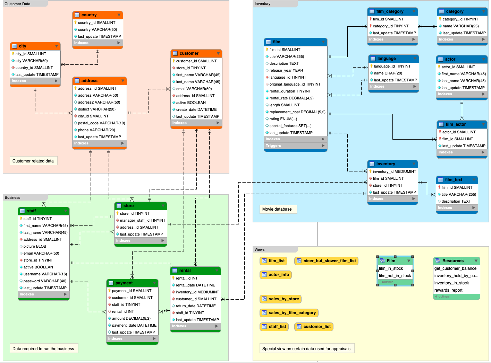

---
## SQL Databases 
---
A SQL database, also known as a relational database, is a system that stores and organizes data into highly structured tables of rows and columns. These databases offer Structured Query Language (SQL) to read and write the data, and are categorized as relational database management systems (RDBMS).
There are numerous SQL database engines (products) used to build software applications. Some of the most popular include PostgreSQL, MySQL, SQL Server, and Oracle. Some database engines are open source while others are commercial offerings.

### ER Diagram (or Enhanced Entity-Relationship (EER))

The following is a sample ER Diagram 

Following points should be observed

Overall diagram

1. Tables (By Business domain i.e Customer Data , Business, Inventory)
2. Relationships between represented by connectors ( Noted by 1-1, 1-m, m-m...)

Within Table 

1. Primary key 
2. Foriegn Key
3. Column Names with Symbols for each ( INT, VARCHAR, DATETIME, BOOLEAN, TEXT )

Others

1. Views - Stored Queries to provide information
2. SQL Routines - SQL routines are routines that have logic implemented with only SQL statements, including SQL Procedural Language (SQL PL) statements

### SQL Commands and Queryies

In  SQL, commands are categorized into DDL, DML, DCL, TCL, and DQL.

Types of SQL Commands : 

1. DML (Data Manipulation Language)
2. DDL (Data Definition Language)
3. DQL (Data Query Language)
4. DCL (Data Control Language)
5. TCL (Transaction Control Language)

Definition of the commands 

- **DDL(Data Definition Language):** To make/perform changes to the physical structure of any table residing inside a database, DDL is used. These commands when executed are auto-commit in nature and all the changes in the table are reflected and saved immediately.

    - CREATE: Creates a new table or database.
    - ALTER: Modifies an existing database object.
    - DROP: Deletes an entire table, database, or other objects.
    - TRUNCATE: Removes all records from a table, deleting the space allocated for the records.
    

- **DML(Data Manipulation Language):** Once the tables are created and the database is generated using DDL commands, manipulation inside those tables and databases is done using DML commands. The advantage of using DML commands is, that if in case any wrong changes or values are made, they can be changed and rolled back easily.

    - SELECT: Retrieves data from the database.
    - INSERT: Adds new data to a table.
    - UPDATE: Modifies existing data within a table.
    - DELETE: Removes data from a table.

- **DQL(Data Query Language):** Data query language consists of only one command upon which data selection in SQL relies. The SELECT command in combination with other SQL clauses is used to retrieve and fetch data from databases/tables based on certain conditions applied by the user.

    - SELECT: Retrieves data from the database. 
    - JOIN: Combines rows from two or more tables based on a related column between them.
    - FROM: Specifies the table from which the data will be retrieed
    - DISTINCT: Fetch Unique Values
    - ORDERBY : Sort the data by column
    - HAVING: filter based on condition
    - LIMIT: Limit the output returned by the query
    - UNION: Combine the Result of two SELECT commands
    - EXISTS: Include Subquery and return any rowns
    - IN: Check if any value is in a list of values
    - LIKE: Used for Patterm Matching in Strings  

- **DCL(Data Control Language):** DCL commands as the name suggests manage the matters and issues related to the data controller in any database. DCL includes commands such as GRANT and REVOKE which mainly deal with the rights, permissions, and other controls of the database system.

    - GRANT: Gives users access privileges to the database.
    - REVOKE: Removes access privileges given with the GRANT command.

- **TCL(Transaction Control Language):** Transaction Control Language as the name suggests manages the issues and matters related to the transactions in any database. They are used to roll back or commit the changes in the database.

    - COMMIT: Saves all changes made in the current transaction.
    - ROLLBACK: Restores the database to the last committed state.
    - SAVEPOINT: Sets a savepoint within a transaction.
    - SET TRANSACTION: Places a name on a transaction.

#### SQL Order of Execution

FROM and/or JOIN clause
WHERE clause
GROUP BY clause
HAVING clause
SELECT clause
DISTINCT clause
ORDER BY clause
LIMIT and/or OFFSET clause

--- 

----

**CONCAT**

SELECT 
    CONCAT('Book Name',':',book_name,',','Author',':',author,',','Book price',':',book_price) as Book_Description 
    FROM books 
    ORDER BY book_name

**ROUND CALCULATION**

SELECT
    emp_id, name, salary, ROUND(salary + (0.2 * salary),0)  as New_salary
    FROM employees
    ORDER BY emp_id

**NOT EQUALTO <>**
SELECT 
    *
    FROM job_history
    WHERE employee_id <> 101
    ORDER BY employee_id, job_id

**OR with Condition**

SELECT name, population, area 
    FROM world 
    WHERE area >= 3000000 OR population >= 25000000 
    ORDER BY name ASC

**LIKE with %**

SELECT original_title, director, genres, cast, budget, revenue, runtime, vote_average
    FROM movies 
    WHERE keywords LIKE '%sport%' OR keywords LIKE '%sequel%' OR keywords LIKE '%suspense%'
    ORDER BY original_title ASC

**NULL**

SELECT employee_id, first_name, last_name, salary
FROM employees
WHERE commission_pct IS NULL
  AND salary BETWEEN 5000 AND 10000
  AND department_id IN (50, 10, 80)
ORDER BY employee_id ASC;

**BETWEEN**

SELECT orderNumber,requiredDate 
    FROM orders 
    WHERE orderDate BETWEEN '2003-12-01' AND '2003-12-31'
    AND status = "Shipped"
    ORDER BY orderNumber

**AND and Condition**

SELECT original_title 
    FROM MOVIES 
    WHERE (release_year > 2014 AND vote_average > 7)
    ORDER BY original_title asc;

**DISTINCT**

SELECT DISTINCT author_id as id
    FROM views
    WHERE author_id = viewer_id
    ORDER BY id

**CASE**

SELECT quantity,
case
  when quantity > 6 then "bulk purchase"
  when quantity between 4 and 6 then "moderate purchase "
  else "small purchase"
end as qty_bucket
from `sathish-scaler-projects.farmers_market.customer_purchases`
order by quantity desc

**LIKE**

SELECT employee_id, 
        concat (first_name ,' ',last_name) as full_name,
        phone_number 
        from employees
        where first_name like '%n'
        order by employee_id

**OFFSET**

SELECT  * from movies order by revenue desc limit 1 OFFSET 2

**NULL**

SELECT employee_id, first_name, last_name, job_id, manager_id
FROM employees
WHERE department_id is NULL
ORDER by employee_id

**Timestamp and Between**

SELECT DISTINCT user_id
FROM purchases
WHERE time_stamp  Between '2022-03-08' and  '2022-03-20' and amount >=  1000
ORDER BY user_id

**"=" Condition Operator**

SELECT * FROM city WHERE countrycode = 'JPN'

**LIMIT and OFFSET**

SELECT
employee_number,
first_name,
last_name,
salary

FROM employees
ORDER BY salary DESC
LIMIT 2 OFFSET 3;

#### Day 4 Assignments - Subqueries , Grouby and Aggregation 

**ROUND**

SELECT employee_id , round(ifnull(commission_pct,0),2) AS commission_pct
 FROM employees
 ORDER BY employee_id;

**SUBQUERIES**

 SELECT employee_id, CONCAT(first_name,' ', last_name) as full_name,salary from
employees e1 join departments d1
on e1.department_id=d1.department_id
and d1.department_name in ( 'Administration', 'Marketing', 'Human Resources');

**NOT IN**
SELECT * from employees
WHERE employee_id not in (select employee_id from job_history)
ORDER BY employee_id asc 

**SUBQUERIES** 

SELECT  CONCAT(first_name,' ', last_name) as full_name, salary, department_id, job_id
FROM employees
WHERE job_id = (SELECT job_id FROM employees WHERE employee_id = 107)
ORDER BY full_name

**SUBQUERIES and CASE Statement**
SELECT employee_id, first_name, last_name, salary, (CASE WHEN job_id IN ('FI_ACCOUNT', 'AC_ACCOUNT') THEN 1 ELSE 0 END) as Accountant
from employees
ORDER BY employee_id

**CASE STATEMENT with Operators**

SELECT employee_id, salary , 
(CASE When salary >  20000 THEN 'Class A'
  When salary BETWEEN 10000 AND 20000 THEN 'Class B'
  When salary <  10000 THEN 'Class C'
END
)AS Salary_bin
FROM employees
ORDER BY employee_id

**MAX Function**

SELECT MAX(num) as num
FROM
    (SELECT num
    FROM mynumbers
    GROUP BY num
    HAVING COUNT(num) =1) AS t

**CASE with Condition**

SELECT x, y, z,
    CASE
        WHEN (x + y > z) AND (y + z > x) AND (x + z > y) THEN 'Yes'
        ELSE 'No'
    END AS triangle
FROM triangle
ORDER BY x, y, z ASC

**CONDITION ** 

select round(sum(long_w),4) as sum
from station
where long_w between 38.7880 and 137.2345;

**Condition**

SELECT
earnings, count(*) as num_employees
FROM(SELECT  (salary*months) AS earnings, employee_id
FROM employee )temp
GROUP BY earnings
HAVING earnings = (SELECT max(salary*months) AS earnings FROM employee)

**IFNULL**

SELECT employeeNumber,firstName,lastName,IFNULL(email,'N/A') as email,IFNULL(phone,'N/A') as phone
FROM employees
ORDER BY employeeNumber 

**JOIN**

SELECT employee_id, first_name, last_name, job_id 
FROM employees e 
JOIN departments d ON e.department_id = d.department_id 
JOIN locations l ON d.location_id = l.location_id 
WHERE l.city = 'Seattle' 
ORDER BY employee_id

**COUNT Aggregation**

SELECT COUNT(DISTINCT(customer_id)) as rich_count
FROM store
WHERE amount > 500

**CALCULATION using ROUND**

SELECT original_title, ROUND(((revenue-budget)/budget) * 100,2)as Profit_percentage 
FROM movies

**ORDERBY**

SELECT name 
FROM students
where marks > 75
ORDER by name, id

**INITCAP**
SELECT employee_number, INITCAP(CONCAT(first_name,' ',last_name)) as 'Full Name'
FROM employees
ORDER BY employee_number

**SUBSTRING** 

SELECT
employee_number,
CONCAT( 
    UPPER(SUBSTRING(first_name,1,1)),
    LOWER(SUBSTRING(first_name,2,LENGTH(first_name))), 
    ' ' , 
    LOWER(last_name) )
 AS 'Full Name'
FROM employees
ORDER BY 1

2nd method 

SELECT employee_number, CONCAT(
    UPPER(SUBSTRING(first_name, 1, 1)),
    LOWER(SUBSTRING(first_name, 2)),
    " ",
    LOWER(last_name)) as `Full Name`
FROM employees ORDER BY employee_number ASC

#### Day 5 - Join Assignments 

**Max Function** 

SELECT 
round(max(lat_n),4) as max
FROM station
where lat_n < 138.2523

select ROUND(lat_n,4)
from station
where lat_n < 138.2523
order by lat_n desc
limit 1

**GROUBP BY and HAVING**

SELECT actor_id, director_id
FROM actordirector
GROUP BY  actor_id, director_id
HAVING count(director_id) >= 3
ORDER BY actor_id

**DENSE_RANK**

SELECT * FROM employees WHERE
salary = (
SELECT salary FROM (
SELECT salary, DENSE_RANK() OVER( order by salary DESC) SALrank FROM employees
GROUP BY salary) tab
WHERE SALrank = 3);

SELECT * FROM employees
WHERE salary = (
SELECT max(salary) FROM employees
WHERE salary < (
SELECT max(salary) FROM employees
WHERE salary < (
SELECT max(salary) FROM employees
)
)
)

-- Using limit and offset
-- SELECT * FROM employees
-- WHERE salary = (
-- SELECT DISTINCT salary FROM employees ORDER BY salary DESC LIMIT 1 OFFSET 2
-- )

---
Doubt Sesssion 

SELECT DISTINCT customer_zip 
FROM `sathish-scaler-projects.farmers_market.customer`
WHERE customer_id in (select customer_id FROM `sathish-scaler-projects.farmers_market.customer_purchases` WHERE market_date = '2019-04-06')

--
**INNER JOIN**

SELECT concat(man.first_name," ",man.last_name) as full_name
from employees man
where man.employee_id in (
SELECT manager_id
from employees emp
group by emp.manager_id
having count(emp.employee_id) >=4
)
order by full_name

Without subquery

SELECT concat(man.first_name," ",man.last_name) as full_name
from employees man
join employees emp
on man.employee_id = emp.manager_id
group by full_name
having count(*)>=4
order by full_name

**JOIN**

SELECT dept.* from departments dept 
join employees emp 
on dept.department_id = emp.department_id
group by dept.department_id, dept.department_name, dept.manager_id, dept.location_id
having min(emp.salary) >= 9000
ORDER by department_id

**JOIN**

select p.product_name, s.year, s.price 
from sales s 
join product p  
on p.product_id = s.product_id
where s.product_id is not NULL
order by year, product_name asc;

**left join** 

select d.department_id, d.department_name 
from departments d
left join employees e 
on d.department_id = e.department_id
where e.department_id is null
order by department_id asc;

**Self join**

SELECT  c1.candidate_id
FROM candidates c1
join candidates c2
on c1.candidate_id=c2.candidate_id and c1.skill!=c2.skill
join candidates c3
on c2.candidate_id=c3.candidate_id and c2.skill!=c3.skill and c1.skill!=c3.skill
where c1.skill="Python" and c2.skill="MySQL" and c3.skill="Tableau"
order by c1.candidate_id;

**AGGREGATE FUNCTIONS - SUM, AVG**

SELECT 
    query_name,
    ROUND(SUM(rating/position)/COUNT(*) ,2) AS quality,
    ROUND(AVG(rating<3) * 100 , 2) AS poor_query_percentage
FROM queries 
GROUP BY query_name
ORDER BY query_name asc;

**CASE STATEMENT with Aggregation** 

SELECT 
department_id AS Department, 
Count(employee_id) AS No_of_employees,
CASE 
    WHEN COUNT(employee_id) = 1 then 'Junior Department'
    WHEN COUNT(employee_id)  between 2 and 4 then 'Intermediate Department'
    WHEN COUNT(employee_id) > 4 then 'Senior Department'
END  AS Department_level
FROM employees
GROUP BY department_id
ORDER BY No_of_employees, Department asc

**JOINS with Where**

SELECT DISTINCT(c.title)
FROM Content c 
JOIN TVProgram t ON 
    t.content_id = c.content_id
WHERE 
    c.Kids_content = 'Y' AND 
    c.content_type= 'Movies' AND 
    t.program_date LIKE '2020-06%'
ORDER by title asc;

**

SELECT s.buyer_id 
FROM Sales s 
JOIN Product p ON
    s.product_id = p.product_id
WHERE 
    p.product_name = 'S8' 
    AND
    NOT EXISTS 
        (
        SELECT 1 
        FROM Sales s2 
        JOIN Product P2 ON
        s2.product_id = p2.product_id
        WHERE 
            p2.product_name = 'iPhone' AND
            s2.buyer_id = s.buyer_id
        )
ORDER BY buyer_id asc;

SELECT DISTINCT s.buyer_id
from Sales as s 
LEFT JOIN Product as p 
    ON s.product_id=p.product_id
where 
    p.product_name='S8' and 
    s.buyer_id not in 
    (
        select s.buyer_id from Sales as s 
        LEFT JOIN Product as p ON 
        s.product_id=p.product_id
    where p.product_name='iPhone'
    )
order by s.buyer_id

SELECT 
    e.name,
    b.bonus
FROM employee e
LEFT JOIN 
    bonus b on
    e.empID = b.empID
WHERE 
    b.bonus < 1000 OR
    b.bonus is NULL
ORDER BY
    b.bonus asc;

SELECT 
    employeeNumber,
    firstName,
    lastName
FROM employees
WHERE employeeNumber NOT IN (
    SELECT DISTINCT salesRepEmployeeNumber 
    FROM customers
    WHERE salesRepEmployeeNumber IS NOT NULL
)
ORDER BY employeeNumber;

**RIGHT JOIN**

SELECT 
    e.employee_id, 
    e.first_name, 
    e.last_name,
    e.department_id,
    d.department_name
FROM employees e 
RIGHT JOIN departments d on
    d.department_id = e.department_id
ORDER BY e.employee_id, d.department_id, e.first_name asc;

SELECT 
    e.employee_id employee_id,
    e.first_name first_name,
    e.last_name last_name,
    d.department_id department_id,
    d.department_name department_name
FROM employees e
RIGHT JOIN departments d
ON d.department_id = e.department_id
ORDER BY employee_id, department_id, first_name

**JOIN**

SELECT c.name 
FROM city c 
join country c1 
ON  c.countrycode = c1.code 
WHERE c1.continent ='Africa'
ORDER BY c.name asc;

SELECT 
p.productCode,
p.productName,
pl.textDescription
FROM products p 
JOIN productlines pl
ON p.productLine = pl.productLine

ORDER BY p.productCode asc;

SELECT p.session_id
FROM Playback p 
LEFT JOIN Ads A
ON  p.customer_id = A.customer_id AND 
    A.timestamp BETWEEN p.start_time and p.end_time
WHERE
  A.ad_id IS NULL 
ORDER BY p.session_id

SELECT e1.symbol as metal, e2.symbol as nonmetal
FROM elements e1, elements e2
WHERE e1.type = 'Metal' AND e2.type = 'Nonmetal'
ORDER BY metal, nonmetal;

SELECT 
    e.employee_id,
    d.department_name,
    j.job_id,
    j.job_title,
    j.min_salary
FROM employees e
JOIN departments d 
    ON e.department_id = d.department_id
JOIN job_history jh 
    ON e.employee_id = jh.employee_id
JOIN jobs j 
    ON j.job_id = jh.job_id
    WHERE j.job_title LIKE '%sales%'  AND j.min_salary >= 6000
ORDER BY e.employee_id, j.min_salary asc;

SELECT 
    DISTINCT e.employee_id, 
    CONCAT(e.first_name, ' ', e.last_name) full_name,
    e.salary,
    e.phone_number, 
    e.department_id, 
    d.department_name,
    l.street_address, 
    l.city, 
    c.country_name, 
    c.region_id, 
    r.region_name
FROM employees e 
JOIN departments d
ON e.department_id = d.department_id
JOIN locations l
ON d.location_id = l.location_id
JOIN countries c
ON c.country_id = l.country_id
JOIN regions r
ON r.region_id = c.region_id
WHERE r.region_name = 'Europe'
ORDER by e.salary desc , e.employee_id asc;

- Q3 

**NOT EXISTS **  this didnt work 
SELECT
    e1.employee_id

FROM employees e1 
WHERE   
    NOT EXISTS (SELECT 1 from employees WHERE  e1.manager_id = employee_id ) AND
    e1.salary < 15000

ORDER BY e1.employee_id asc;

** LEFT JOIN WORKED **

SELECT
    e1.employee_id

FROM employees e1 
LEFT JOIN employees e2
    ON e1.manager_id = e2.employee_id
WHERE
    e2.employee_id is NULL AND
    e1.manager_id is NOT NULL AND
    e1.salary < 15000

ORDER BY e1.employee_id asc;

- Q5
**LEFT JOIN with SUBQUERY**

SELECT 
    CONCAT(e1.first_name,' ',e1.last_name) full_name
FROM 
    employees e1
LEFT JOIN
    (
        SELECT department_id, SUM(salary) as dept_total 
        FROM employees
        GROUP BY department_id
    )  as dept_filter
ON e1.department_id = dept_filter.department_id

WHERE 
    e1.salary > 0.4 * dept_filter.dept_total OR
    e1.department_id IS NULL
ORDER BY
    full_name asc; 

- Q4 

**COLASCE**

SELECT 
    d.department_name,
    COALESCE(COUNT(e.employee_id), 0) as No_of_Employees,
    SUM(e.salary) as Total_Salary
FROM departments d
LEFT JOIN employees e ON d.department_id = e.department_id
GROUP BY d.department_name
ORDER BY d.department_name;

- Q6

**CROSS JOIN**

SELECT 
    MIN(round(sqrt(power((p1.x - p2.x),2) + power((p1.y- p2.y),2)),2)) as shortest
FROM points p1 
CROSS JOIN points p2
WHERE 
  NOT (p1.x = p2.x AND p1.y = p2.y)

**SELF JOIN**

SELECT DISTINCT l1.account_id
FROM loginfo l1
JOIN loginfo l2
on l1.account_id = l2.account_id 
WHERE 
    l1.ip_address != l2.ip_address and 
    l1.login <= l2.logout AND 
    l2.login <= l1.logout
ORDER BY l1.account_id asc

Q1 - Additional 

--Without Joins
select name
from salesperson
where sales_id not in
    (select sales_id
    from orders
    where com_id =
        (select com_id
        from company
        where name = 'RED'))
order by name;

--Using Left Join

select S.name
from salesperson as S
left join
(select *
from orders
where com_id = (
    select com_id
    from company
    where name = 'RED'
))R
on S.sales_id = R.sales_id
where R.order_id is NULL
order by S.name;

q2.Additional 

SELECT 
    e1.employee_id,
    e1.first_name,
    e1.last_name
FROM 
    employees e1
LEFT JOIN employees e2
ON e1.manager_id=e2.employee_id
WHERE 
    e1.manager_id is NOT NULL and
    e1.hire_date < e2.hire_date

ORDER BY e1.employee_id asc; 

Q3. 
**WHERE CONDITIONS**

SELECT 
    DISTINCT c.customer_id,
    c.customer_name
FROM
    customers c
JOIN orders o 
ON c.customer_id = o.customer_id
WHERE c.customer_id IN (
    SELECT customer_id 
    FROM orders 
    WHERE product_name IN ('Bread', 'Milk')
    GROUP BY customer_id
    HAVING COUNT(DISTINCT product_name) = 2
)
AND c.customer_id NOT IN (
    SELECT customer_id 
    FROM orders 
    WHERE product_name = 'Eggs'
)
ORDER BY  c.customer_name asc; 

*** Day 9 Assignments

**SELF JOIN/INNER JOIN**

SELECT  f1.follower, 
        count(distinct f2.follower) as num 
FROM follow f1 
INNER JOIN follow f2
ON f1.follower = f2.followee 
group by f1.follower 
order by f1.follower;

**WINDOW Functions RANK DENSE RANK and ROW Number**

Q2.
SELECT 
    CONCAT(e1.first_name,' ',e1.last_name) as full_name,
    e1.department_id,
    e1.salary,
    row_number() over (partition by department_id order by e1.salary desc) as emp_row_no,
    rank() over (partition by department_id order by e1.salary desc) as emp_rank,
    dense_rank() over (partition by department_id order by e1.salary desc) as emp_dense_rank

FROM employees e1
ORDER BY e1.department_id ASC, e1.salary DESC;

Q4.

WITH RankedEmployees as 
(
    SELECT 
        employee_id,
        first_name,
        job_id,
        dense_rank() over (partition by job_id ORDER by salary desc) as emp_sal_rank
    FROM employees 
)
SELECT 
    employee_id,
    first_name,
    job_id
FROM RankedEmployees
Where emp_sal_rank = 5
ORDER by employee_id;

another approach 

SELECT
    employee_id,
    first_name,
    job_id
FROM
    (select
        employee_id,
        first_name,
        job_id,
        dense_rank() over(partition by job_id order by salary desc) as salary_rank
    from employees) tab1
    where salary_rank = 5
    order by employee_id

Q1. Teams

SELECT 
    t1.team_name as home_team,
    t2.team_name as away_team
FROM teams t1
CROSS JOIN teams t2
WHERE t1.team_name != t2.team_name
ORDER BY home_team, away_team;

Q3. 
**ROW_NUMBER**

select window_table.first_col, window_table1.second_col
from(
    select first_col,
    row_number() over(order by first_col) as first_coulmn
    from data
    order by first_coulmn
) as window_table
join
(
    select second_col,
    row_number() over(order by second_col desc) as second_coulmn
    from data
    order by second_coulmn
) as window_table1
on window_table.first_coulmn = window_table1.second_coulmn;

Another approach 

select first_col,second_col
from
(
    select first_col,
    row_number() over ( order by first_col asc ) as A
    from data
) as FC
inner join (
    select second_col,
     row_number() over ( order by second_col desc ) as B
from data
 ) as SC
on FC.A =SC.B

**Simple Dense Rank**

SELECT 
    score,
    dense_rank() over (order by score desc) as 'rank'
FROM scores
order by score desc

**Window Function with CASE Statement**

WITH Calculcated_Salaries as
( 
   SELECT 
    company_id,
    employee_id,
    employee_name,
    (
        CASE
            WHEN MAX(salary) OVER (PARTITION BY company_id) < 1000 THEN ROUND(salary * 1)
            WHEN MAX(salary) OVER (PARTITION BY company_id) BETWEEN 1000 AND 10000 THEN ROUND(salary * 0.76)
            ELSE ROUND(salary * 0.51)
        END
    ) as salary 
    FROM salaries
)
SELECT
    company_id,
    employee_id,
    employee_name,
    salary
FROM Calculcated_Salaries
ORDER BY company_id, employee_id ASC;

**Window Function with AVG**

WITH calculated_table as 
    (
        SELECT   
        employee_id,
        first_name,
        last_name,
        department_id, 
        salary,
        AVG(salary) over (partition by department_id) as avg_dept_salary
        FROM employees
    )
SELECT 
    employee_id,
    first_name,
    last_name,
    department_id,
    salary
FROM calculated_table
where avg_dept_salary > salary

ORDER BY employee_id asc;

**Salary Count**

WITH salary_counts AS (
    SELECT 
        salary
    FROM employees
    GROUP BY salary
    HAVING COUNT(*) >= 2
)
SELECT 
    e.employee_id,
    e.name,
    e.salary,
    dense_rank() over (order by e.salary) as team_id
FROM employees e
JOIN salary_counts sc ON e.salary = sc.salary
ORDER BY employee_id

**ROW_Number Ranking**

WITH RankedOrders AS 
(
    SELECT 
        c.name as customer_name,
        c.customer_id,
        o.order_id,
        o.order_date,
        row_number() over (partition by c.customer_id order by o.order_date desc) as rn
    FROM orders o
    JOIN customers c 
    ON c.customer_id = o.customer_id
)
SELECT 
    customer_name,
    customer_id,
    order_id,
    order_date

FROM RankedOrders 
Where rn <= 3 

ORDER BY customer_name asc, customer_id asc, order_date desc

### Day 10 Assignments

Q1.
**Window Function **

SELECT 
    t.account_id,
    t.day,
    SUM(
        CASE 
        WHEN type = 'Deposit' THEN amount 
        ELSE -amount 
        END 
        ) 
        OVER (PARTITION BY account_id ORDER BY day) as balance
FROM transactions t
ORDER BY t.account_id, t.day; 

**Window Function**

SELECT
    distinct first_name,
    first_value(start_date) OVER (PARTITION BY first_name ORDER BY start_date ASC) AS first_day_job
FROM (
    SELECT
        e.first_name,
        jb.start_date
    FROM
        employees AS e
        JOIN job_history AS jb ON e.employee_id = jb.employee_id
    ) t
ORDER BY first_name;

WITH tempTable AS
(
    SELECT
        e.first_name,
        jb.start_date
    FROM
        employees AS e
        JOIN job_history AS jb ON e.employee_id = jb.employee_id
)
SELECT
    distinct first_name,
    first_value(start_date) OVER (PARTITION BY first_name ORDER BY start_date ASC) AS first_day_job
FROM tempTable
ORDER BY first_name;

**Q2 - Window Functions**

SELECT 
    player_id,
    event_date,
    sum(games_played) over (partition by player_id order by event_date asc ) as games_played_so_far

FROM activity
ORDER BY player_id, games_played_so_far asc;

**Q3 - Window Functions**

With temptable as
(
SELECT 
    employee_id,
    salary,
    lead(salary) over (order by salary) as next_higher_salary
FROM employees
)
SELECT 
        employee_id,
        salary,
        next_higher_salary,
        next_higher_salary - salary as salary_difference
FROM temptable

order by salary, salary_difference

**Q4.NTH VALUE**

SELECT
    productLine,
    productName,
    MSRP,
    NTH_VALUE(productName, 3) OVER (PARTITION BY productLine ORDER BY MSRP DESC) AS thirdMostExpensive_Product,
    NTH_VALUE(productName, 5) OVER (PARTITION BY productLine ORDER BY MSRP DESC) AS fifthMostExpensive_Product
FROM products
ORDER BY productLine ASC, MSRP DESC;

**Q6.Window Functions**

WITH data AS (
    SELECT
        order_id,
        AVG(quantity) AS avg_quantity,
        MAX(AVG(quantity)) OVER() AS max_avg_quantity,
        MAX(quantity) AS max_quantity
    FROM ordersdetails
    GROUP BY order_id
)

SELECT order_id
FROM data
WHERE max_quantity > max_avg_quantity
ORDER BY order_id

**Q8. Window Function**

Without Window 

SELECT 
    e.first_name,
    MAX(j.start_date) as recent_job
FROM employees e 
JOIN job_history j ON e.employee_id = j.employee_id
GROUP BY e.first_name
ORDER BY first_name

with First Value Window function 

SELECT DISTINCT e.first_name,
    FIRST_VALUE(j.start_date) OVER (
        PARTITION BY e.employee_id 
        ORDER BY j.start_date DESC
    ) as recent_job
FROM employees e 
JOIN job_history j ON e.employee_id = j.employee_id
ORDER BY first_name

**Q7 - NTILE**

select customerName,
sum(amount) as total_amount,
ntile(4) over (order by sum(amount) desc) as sales_quartile

from customers c join payments p
on c.customerNumber =p.customerNumber
group by c.customerName
order by total_amount desc,sales_quartile asc

**NTH-ROW**

SELECT
    o.customerNumber,
    o.orderNumber,
    od.productCode,
    round(od.quantityOrdered*od.priceEach,2) AS sales,
    NTH_VALUE(round(od.quantityOrdered * od.priceEach,2), 3) 
        OVER 
        (
            PARTITION BY customerNumber 
            ORDER BY od.quantityOrdered*od.priceEach DESC 
            ROWS BETWEEN UNBOUNDED PRECEDING AND UNBOUNDED FOLLOWING
        ) AS thirdHighestSales
FROM orders as o
JOIN orderdetails as od
ON o.orderNumber = od.orderNumber
ORDER BY customerNumber ASC, sales DESC;

**FIRST_VALUE and DISTINCT**

SELECT DISTINCT
    e.first_name,
    e.last_name,
    FIRST_VALUE(j.max_salary) OVER (partition by jh.employee_id order by jh.start_date) as first_job_sal
FROM employees e
JOIN job_history jh 
ON e.employee_id = jh.employee_id
JOIN jobs j
ON j.job_id = jh.job_id

ORDER  BY e.first_name;

**LEAD LAG**

select id, visit_date, people9 as people
from
(
    select *,
        case when (people >= 100 AND people_1 >= 100 AND people_2 >= 100) OR
        (people >= 100 AND people_1 >= 100 AND people1 >= 100) OR
        (people >= 100 AND people1 >= 100 AND people2 >= 100)  
        then people
        end as people9
    from(SELECT *,
        lead(people,2) over(order by visit_date) people2,
        lead(people,1) over(order by visit_date) people1,
        lag(people,1) over(order by visit_date)  people_1,
        lag(people,2) over(order by visit_date)  people_2
    from mall
    ) tbl
) tbl2
where people9 is not null
order by visit_date
